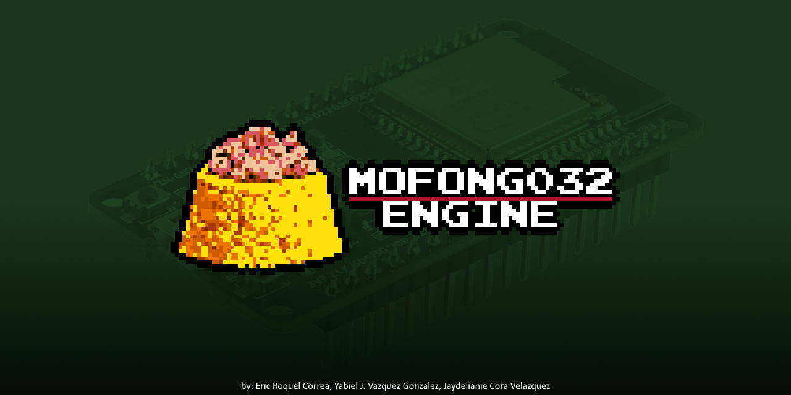

# MOFONGO32


### Dual-ESP32 Retro Videogame Console

> A retro-inspired dual-ESP32 fantasy console with composite NTSC video, MASA scripting, Bluetooth controller support, and real hardware gameplay.

----------



## Features

-   Dual ESP32 architecture
    
-   Composite NTSC video output
    
-   MASA scripting runtime
    
-   Audio engine
    
-   Bluetooth controller support
    
-   SPIFFS game loading
    
-   Retro-style homebrew development
    
-   Real hardware execution
    

----------

## Project Architecture

```text
ESP32 #1 (Logic)
├── MASA Runtime
├── Bluetooth Input
├── Audio
└── SPIFFS (game.masa)

        ⇅ SPI

ESP32 #2 (Video)
├── NTSC Composite Renderer
└── Video Overlay/UI

```

----------

## Repositories Used

This project uses the following repositories:

-   [ESP32CompositeVideo](https://github.com/bitluni/ESP32CompositeVideo?utm_source=chatgpt.com)
    
-   [ESP32CompositeColorVideo](https://github.com/marciot/ESP32CompositeColorVideo?utm_source=chatgpt.com)
    

----------

# Hardware Overview

## Logic ESP32 (Master)

Responsible for:

-   MASA runtime execution
    
-   Bluetooth controller input
    
-   Audio
    
-   SPIFFS filesystem
    
-   Game logic
    

## Video ESP32 (Slave)

Responsible for:

-   NTSC composite rendering
    
-   UI overlay
    
-   Video output
    

----------

# Quick Start

## Prerequisites

You will need:

-   Two ESP32 boards
    
-   Two USB cables
    
-   Arduino IDE
    
-   `game.masa` exported from the Mofongo IDE
    

### Recommended Setup

Environment

Purpose

ESP32 Core 1.0.6

Video ESP32

ESP32 + Bluepad32

Logic ESP32

----------

# Build Configuration

Inside `AudioVideoExample.ino`:

```cpp
#define USE_DUAL_ESP 1
#define USE_MASA_RUNTIME 1

// Logic build
#define DUAL_ESP_ROLE_VIDEO 0
#define ENABLE_BT_CONTROLLER 1

// Video build
#define DUAL_ESP_ROLE_VIDEO 1
#define ENABLE_BT_CONTROLLER 0

```

----------

# Flashing Guide

## Flashing the Logic ESP32

1.  Open the project using the Bluepad32 ESP32 core.
    
2.  Select:
    

```text
Tools > Board > ESP32 + Bluepad32 Arduino

```

3.  Select a partition with SPIFFS support.  
    Recommended:
    

```text
Huge APP

```

4.  Set:
    

```cpp
#define DUAL_ESP_ROLE_VIDEO 0

```

5.  Upload to the Logic ESP32.
    
6.  Open Serial Monitor at:
    

```text
115200 baud

```

Expected output:

```text
[Mofongo] role=logic, spi=master
[Mofongo] SPIFFS ok
[Mofongo] MASA loaded

```

----------

## Flashing the Video ESP32

1.  Open the project using ESP32 Core 1.0.6.
    
2.  Select your ESP32 board.
    
3.  Set:
    

```cpp
#define DUAL_ESP_ROLE_VIDEO 1

```

4.  Upload to the Video ESP32.
    

If successful, the TV should display the video overlay and runtime.

----------

# SPIFFS Setup

> SPIFFS is ONLY required on the Logic ESP32.

Whenever `game.masa` changes, SPIFFS must be rebuilt and reflashed.

## Required Layout

```text
/project/data/game.masa

```

----------

## SPIFFS Configuration

Using Bluepad32 Huge APP:

Setting

Value

Offset

`0x310000`

Size

`0xE0000`

----------

## Flash SPIFFS Using GUI

Use the Mofongo SPIFFS Builder:

1.  Select:
    

```text
AudioVideoExample/data

```

2.  Set:
    

```text
Size   → 0xE0000
Offset → 0x310000

```

3.  Build `spiffs.bin`
    
4.  Flash to the Logic ESP32
    

----------

## Flash SPIFFS Using CLI

```bash
py -m esptool --chip esp32 --port COMX --baud 921600 write-flash 0x310000 spiffs.bin

```

----------

# Python Tools

Located inside:

```text
tools/

```

----------

## Activate Virtual Environment

```bash
cd C:\Users\YourUser\Desktop\MofongoEngine
.\.venv\Scripts\activate

```

----------

## Run SPIFFS Builder

```bash
python tools\mofongo_spiffs_builder.py

```

----------

## Run Emulator

```bash
python tools\mofongo_emulator.py

```

----------

## Exit venv

```bash
deactivate

```

----------

# Wiring Diagram

## SPI Communication

Logic ESP32

Video ESP32

GPIO 18

SCLK

GPIO 19

MISO

GPIO 23

MOSI

GPIO 5

CS

GND

GND

----------

# Troubleshooting

## Black Screen

-   Ensure the Video ESP32 uses ESP32 Core 1.0.6
    
-   Confirm NTSC wiring
    
-   Verify composite output connection
    

----------

## Missing Objects

Check:

-   `SPI: LINK` appears in overlay
    
-   Logic ESP32 shows:
    

```text
MASA loaded

```
----------
# Hardware Limitations

MOFONGO32 is designed around real ESP32 hardware constraints.  
Because of this, the system embraces retro-style limitations similar to classic consoles.

These limitations are intentional and help maintain stable NTSC rendering and gameplay performance.

----------

## Current Technical Limitations

### Video Constraints

-   Composite NTSC rendering is CPU intensive
    
-   Limited effective framebuffer bandwidth
    
-   Video timing must remain cycle-stable
    
-   Some advanced effects may reduce framerate stability
    

----------

### Memory Constraints

-   ESP32 RAM is limited compared to modern systems
    
-   Large spritesheets and tilemaps must be optimized
    
-   Audio, scripting, and rendering share system memory
    
-   SPIFFS capacity depends on partition layout
    

----------

### Dual-ESP Communication

-   Logic and video synchronization occurs over SPI
    
-   Excessive object updates may impact frame stability
    
-   Communication bandwidth is intentionally lightweight
    

----------

### Audio Limitations

-   Audio currently uses lightweight playback methods
    
-   Streaming large audio assets may impact performance
    
-   Retro-style sound design is recommended
    

----------

### Rendering Constraints

To maintain stable NTSC output, the engine is optimized for:

-   Pixel art graphics
    
-   Low-resolution rendering
    
-   Retro-style sprite counts
    
-   Tile-based environments
    
-   Lightweight visual effects
    

----------

## Recommended Design Philosophy

MOFONGO32 works best when projects embrace retro console design principles:

-   Small sprites
    
-   Tilemaps
    
-   Limited palettes
    
-   Efficient scripting
    
-   Arcade-style gameplay
    
-   Retro audio design
    

The platform is intentionally focused on creativity within constraints, similar to classic systems like the NES, SNES, and other fantasy consoles.

----------

## Future Improvements

Some limitations may improve over time through:

-   Better DMA usage
    
-   Optimized SPI communication
    
-   Improved rendering pipelines
    
-   Audio engine optimizations
    
-   SD card streaming
    
-   Enhanced runtime architecture
    

However, the project will continue prioritizing:

-   simplicity
    
-   real hardware execution
    
-   retro authenticity
    
-   stable composite video output
----------
# Roadmap

-   Dual ESP communication
    
-   Composite NTSC output
    
-   MASA runtime
    
-   Bluetooth controller support
    
-   SD card loading
    
-   Save states
    
-   Audio streaming
    
-   Online SDK
    
-   Built-in game launcher
    
-   Multiplayer support
    

----------

# Gallery

> Add screenshots, gameplay GIFs, and hardware photos here.

```text
/docs/images/
/docs/gifs/

```

----------

# Contributing

Contributions are welcome.

Feel free to:

-   Improve the runtime
    
-   Add demos
    
-   Expand MASA
    
-   Improve documentation
    
-   Optimize rendering
    
-   Build games
    

----------

# License

Add your preferred license here.

Recommended:

-   MIT
    
-   GPLv3
    
-   Apache 2.0
    

----------

# Vision

MOFONGO32 is designed to bring back the feeling of retro console development while using modern ESP32 hardware and custom scripting technology.

The goal is to make homebrew development fun, accessible, and hardware-driven again.
